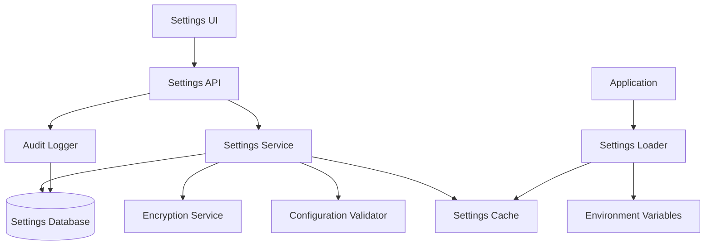

# Design Document - Admin Settings Management

## Overview

The Admin Settings Management system provides a comprehensive solution for managing system-wide configurations through a web interface with secure database persistence. The system replaces hardcoded environment variables with dynamic, encrypted database storage while maintaining backward compatibility.

## Architecture

### High-Level Architecture



### Component Layers

1. **Presentation Layer**: React/Svelte UI components for settings management
2. **API Layer**: tRPC endpoints for CRUD operations
3. **Service Layer**: Business logic for settings management, validation, and encryption
4. **Data Layer**: Prisma models and database operations
5. **Infrastructure Layer**: Caching, encryption, and configuration loading

## Components and Interfaces

### 1. Database Schema

#### Settings Table
```prisma
model Setting {
  id          Int      @id @default(autoincrement())
  category    String   @db.VarChar(50)  // 'smtp', 'oauth', 'general'
  key         String   @db.VarChar(100) // 'host', 'port', 'username'
  value       String?  @db.Text         // Encrypted for sensitive data
  isEncrypted Boolean  @default(false)
  isActive    Boolean  @default(true)
  createdAt   DateTime @default(now())
  updatedAt   DateTime @updatedAt
  createdBy   Int
  updatedBy   Int
  
  creator User @relation("SettingCreator", fields: [createdBy], references: [id])
  updater User @relation("SettingUpdater", fields: [updatedBy], references: [id])
  
  @@unique([category, key])
  @@index([category])
  @@index([isActive])
}
```

#### Settings Audit Table
```prisma
model SettingAudit {
  id        Int      @id @default(autoincrement())
  settingId Int?     // Null for deleted settings
  category  String   @db.VarChar(50)
  key       String   @db.VarChar(100)
  oldValue  String?  @db.Text
  newValue  String?  @db.Text
  action    String   @db.VarChar(20) // 'CREATE', 'UPDATE', 'DELETE'
  userId    Int
  timestamp DateTime @default(now())
  ipAddress String?  @db.VarChar(45)
  userAgent String?  @db.Text
  
  user User @relation(fields: [userId], references: [id])
  
  @@index([category])
  @@index([timestamp])
  @@index([userId])
}
```

### 2. Settings Service

#### Core Interface
```typescript
interface ISettingsService {
  // CRUD Operations
  getSetting(category: string, key: string): Promise<string | null>
  getSettings(category: string): Promise<Record<string, string>>
  setSetting(category: string, key: string, value: string, isEncrypted?: boolean): Promise<void>
  deleteSetting(category: string, key: string): Promise<void>
  
  // Bulk Operations
  setSettings(category: string, settings: Record<string, string>): Promise<void>
  getAllSettings(): Promise<Record<string, Record<string, string>>>
  
  // Validation & Testing
  validateSettings(category: string, settings: Record<string, string>): Promise<ValidationResult>
  testSmtpSettings(settings: SmtpSettings): Promise<TestResult>
  
  // Backup & Restore
  exportSettings(): Promise<EncryptedBackup>
  importSettings(backup: EncryptedBackup): Promise<ImportResult>
  
  // Cache Management
  refreshCache(): Promise<void>
  clearCache(category?: string): Promise<void>
}
```

#### Settings Categories
```typescript
enum SettingsCategory {
  SMTP = 'smtp',
  OAUTH = 'oauth',
  GENERAL = 'general',
  SECURITY = 'security'
}

interface SmtpSettings {
  host: string
  port: number
  username: string
  password: string
  sender: string
  secure: boolean
}

interface OAuthSettings {
  googleClientId?: string
  googleClientSecret?: string
  githubClientId?: string
  githubClientSecret?: string
}
```

### 3. Encryption Service

#### Interface
```typescript
interface IEncryptionService {
  encrypt(plaintext: string): Promise<string>
  decrypt(ciphertext: string): Promise<string>
  rotateKeys(): Promise<void>
  isEncrypted(value: string): boolean
}
```

#### Implementation Strategy
- Use AES-256-GCM for symmetric encryption
- Store encryption keys in secure key management system
- Support key rotation with backward compatibility
- Add integrity verification for encrypted data

### 4. Configuration Loader

#### Interface
```typescript
interface IConfigurationLoader {
  loadConfiguration(): Promise<AppConfiguration>
  refreshConfiguration(): Promise<void>
  getConfigValue(key: string): string | undefined
  watchForChanges(callback: (changes: ConfigChange[]) => void): void
}
```

#### Loading Priority
1. Database settings (highest priority)
2. Environment variables (fallback)
3. Default values (last resort)

### 5. API Endpoints

#### tRPC Router Structure
```typescript
export const settingsRouter = router({
  // Get settings
  getSettings: adminProcedure
    .input(z.object({ category: z.string() }))
    .query(async ({ input }) => { /* ... */ }),
    
  // Update settings
  updateSettings: adminProcedure
    .input(z.object({
      category: z.string(),
      settings: z.record(z.string())
    }))
    .mutation(async ({ input, ctx }) => { /* ... */ }),
    
  // Test SMTP
  testSmtp: adminProcedure
    .input(smtpSettingsSchema)
    .mutation(async ({ input }) => { /* ... */ }),
    
  // Export/Import
  exportSettings: adminProcedure
    .mutation(async () => { /* ... */ }),
    
  importSettings: adminProcedure
    .input(z.object({ backup: z.string() }))
    .mutation(async ({ input }) => { /* ... */ }),
    
  // Audit log
  getAuditLog: adminProcedure
    .input(z.object({
      category: z.string().optional(),
      limit: z.number().default(50),
      offset: z.number().default(0)
    }))
    .query(async ({ input }) => { /* ... */ })
})
```

## Data Models

### Settings Configuration Schema
```typescript
const smtpSettingsSchema = z.object({
  host: z.string().min(1, "SMTP host is required"),
  port: z.number().min(1).max(65535),
  username: z.string().email("Invalid email format"),
  password: z.string().min(1, "Password is required"),
  sender: z.string().min(1, "Sender is required"),
  secure: z.boolean().default(true)
})

const oauthSettingsSchema = z.object({
  googleClientId: z.string().optional(),
  googleClientSecret: z.string().optional(),
  githubClientId: z.string().optional(),
  githubClientSecret: z.string().optional()
})
```

### Validation Rules
- SMTP host must be valid hostname or IP
- SMTP port must be valid port number
- Email addresses must be valid format
- OAuth client IDs must match provider format
- Passwords must meet minimum security requirements

## Error Handling

### Error Types
```typescript
enum SettingsErrorType {
  VALIDATION_ERROR = 'validation_error',
  ENCRYPTION_ERROR = 'encryption_error',
  DATABASE_ERROR = 'database_error',
  PERMISSION_ERROR = 'permission_error',
  TEST_FAILED = 'test_failed'
}

interface SettingsError {
  type: SettingsErrorType
  message: string
  field?: string
  details?: Record<string, any>
}
```

### Error Handling Strategy
- Validate all inputs before processing
- Provide specific error messages for validation failures
- Log all errors with context for debugging
- Return user-friendly error messages
- Implement retry logic for transient failures

## Testing Strategy

### Unit Tests
- Settings service CRUD operations
- Encryption/decryption functionality
- Configuration validation logic
- Cache management operations

### Integration Tests
- Database operations with real database
- SMTP testing with mock email server
- OAuth configuration validation
- Settings loading and priority resolution

### End-to-End Tests
- Complete settings management workflow
- UI interactions and form validation
- Settings backup and restore process
- Audit log generation and viewing

### Test Data Management
- Use test-specific encryption keys
- Mock external services (SMTP, OAuth providers)
- Clean up test data after each test
- Use database transactions for isolation

## Security Considerations

### Data Protection
- Encrypt all sensitive settings (passwords, secrets)
- Use secure key management for encryption keys
- Implement proper access controls (admin only)
- Audit all settings changes with user tracking

### Input Validation
- Validate all inputs against strict schemas
- Sanitize user inputs to prevent injection
- Implement rate limiting on settings endpoints
- Use CSRF protection for state-changing operations

### Authentication & Authorization
- Require admin role for all settings operations
- Implement session validation for API calls
- Log all access attempts and changes
- Use secure session management

## Performance Considerations

### Caching Strategy
- Cache frequently accessed settings in memory
- Implement cache invalidation on updates
- Use Redis for distributed caching if needed
- Set appropriate cache TTL values

### Database Optimization
- Index frequently queried columns
- Use connection pooling for database access
- Implement query optimization for audit logs
- Consider read replicas for heavy read workloads

### Monitoring & Metrics
- Track settings access patterns
- Monitor cache hit rates
- Alert on encryption/decryption failures
- Log performance metrics for optimization